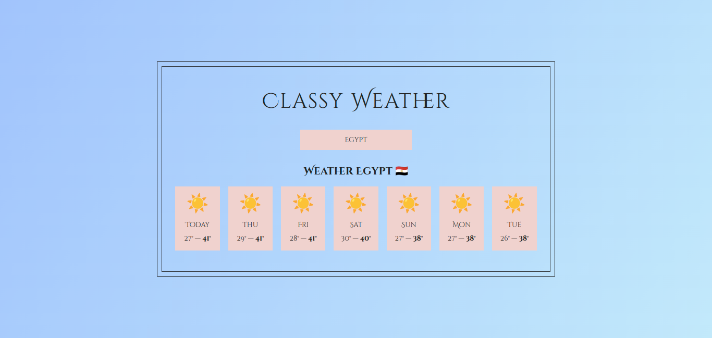

# 🌤️ Classy Weather App

Welcome to **Classy Weather**, a sleek and stylish weather application that helps you stay updated with the latest weather conditions! 🌍✨

## 🚀 Live Demo

Check out the live demo here: [Classy Weather](https://classy-weather-2193.netlify.app/)

## 📸 Screenshot



## 🛠️ Features

- **Real-time Weather Data**: Get up-to-date weather information for your location.
- **Responsive Design**: Optimized for both desktop and mobile devices.
- **Stylish UI**: A clean and elegant interface with a focus on usability.
- **Multi-day Forecast**: View the weather forecast for multiple days ahead.

## 🔧 Tech Stack

- **React.js**: A JavaScript library for building user interfaces.
- **CSS**: Custom styling for a unique look and feel.
- **OpenWeather API**: Fetches real-time weather data.

## 🚧 Installation & Setup

1. **Clone the repository**:

   ```bash
   git clone https://github.com/AnasHany2193/Classy-Weather.git
   ```

2. **Navigate to the project directory**:

   ```bash
   cd Classy-Weather
   ```

3. **Install dependencies**:

   ```bash
   npm install
   ```

4. **Start the development server**:

   ```bash
   npm start
   ```

   The app will run at `http://localhost:3000`.

## 📝 License

This project is licensed under the MIT License. Feel free to fork, clone, and contribute!

## 🙌 Acknowledgments

- **OpenWeather API** for providing the weather data.
- **React** for the awesome front-end library.
- **Netlify** for hosting the live demo.

---

Made with ❤️ by [Anas Hany](https://www.linkedin.com/in/anashany219/)
